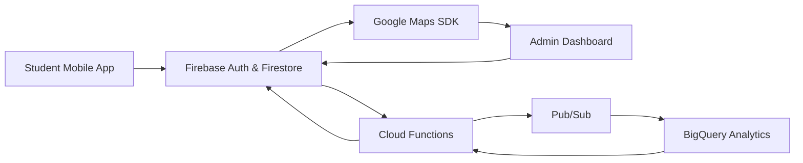

# CampusIQ v1.1

**Admin-Only College Operations Intelligence Platform**

CampusIQ is an enterprise-grade mobile application designed exclusively for college and university administrators. Built for principals, deans, registrars, directors, and executive leadership, it provides a unified platform for managing institutional operations, tracking compliance, and making data-driven decisions.

---

## What's New in v1.1

### Role-Based Permission System
Granular access control for administrative roles:
- **Registrar** — Create and view tasks
- **Dean** — Create, close tasks, export reports
- **Director** — Full operational control (except system config)
- **Executive** — Read-only dashboards, reports, finance, compliance

### Campus Health Score
Real-time institutional health indicator (0–100) computed from:
- Overdue tasks
- Compliance risks
- Pending approvals
- Escalations
- Budget concerns

Color-coded display with AI-generated executive summary powered by Gemini.

### Audit Log System
Enterprise-grade activity tracking:
- Task creation, status changes, priority updates
- Administrative comments
- Compliance-related actions
- Full audit trail per task with role attribution

### Enhanced UX
- Polished empty states across all screens
- Role-aware navigation (actions hidden for read-only roles)
- Consistent administrative terminology
- Executive-first dashboard design

---

## Overview

CampusIQ transforms how academic institutions manage their administrative workflows. Unlike student-facing applications, CampusIQ is purpose-built for executive leadership and senior staff, offering:

- **Executive Dashboard** — Real-time Campus Health Score and operational metrics
- **AI-Powered Analysis** — Gemini AI integration for intelligent task prioritization
- **Campus Operations Map** — Geographic visualization of facilities and activities
- **Role-Based Access** — Granular permissions per administrative role
- **Audit Trail** — Complete activity logging for compliance and accountability
- **Push Notifications** — Instant alerts for high-priority items
- **Offline Capability** — Continue working without connectivity, auto-sync when online

---

## Core Modules

### 🎓 Academic & Exam Management

* Exam schedules & room allocation
* Conflict detection and load balancing
* Real-time updates for students and faculty
* Centralized exam operations dashboard

### 🏫 Campus Operations

* Announcements & notices
* Department-level coordination
* Infrastructure and resource visibility

### 📊 Crowd Intelligence (Admin Only)

* Anonymous crowd density heatmaps
* Hotspot detection (libraries, exam halls, canteen, events)
* Time-based trends (15 min, 1 hour, daily)
* Designed for **safety, planning, and congestion control**

> ⚠️ No cameras. No personal tracking.
> All data is anonymized, aggregated, and privacy-first.

### 🔐 Security & Trust Layer

* Role-based access control
* Firebase Authentication
* Secure APIs and encrypted transport
* Abuse prevention and rate limiting

---

## Key Features

### For Administrators

- **Operations Management** — Create, track, and resolve institutional tasks
- **Priority Classification** — AI-assisted categorization (Admissions, Academics, Compliance, Finance, HR, IT, Facilities)
- **Status Workflows** — New → In Progress → Completed / Escalated
- **Performance Metrics** — Average resolution time and workload distribution
- **Audit Compliance** — Full activity trail for regulatory requirements

### Enterprise Architecture

- **Firebase Backend** — Scalable, real-time database with offline persistence
- **Redux State Management** — Predictable application state with audit integration
- **TypeScript** — Type-safe development
- **React Native** — Cross-platform (Android primary, iOS ready)

---

## Target Users

CampusIQ is designed for authorized institutional personnel only:

| Role | Access Level | Permissions |
|------|--------------|-------------|
| Executive | Strategic oversight | View-only dashboards, reports, compliance |
| Director | Full operations | Create, close, assign, delete tasks; manage compliance/finance |
| Dean | Academic leadership | Create, close tasks; export reports; view compliance |
| Registrar | Records management | Create and view tasks |

---

## 🏗️ System Architecture



---

## Project Structure

```
src/
├── components/
│   ├── AuditTrail.tsx      # Audit log display component
│   ├── EmptyState.tsx      # Polished empty state variants
│   ├── HealthScoreCard.tsx # Campus health score display
│   ├── PermissionGate.tsx  # Role-based UI guard
│   ├── ReportForm.tsx      # Task creation form
│   ├── StatusBadge.tsx     # Status/priority badges
│   └── TaskCard.tsx        # Task card component
├── config/
│   └── permissions.ts      # Centralized role permissions
├── navigation/
│   └── RootNavigator.tsx   # Role-aware navigation
├── redux/
│   ├── auditSlice.ts       # Audit log state
│   ├── authSlice.ts        # Authentication with admin roles
│   ├── store.ts            # Redux store configuration
│   └── taskSlice.ts        # Operations/tasks state
├── screens/
│   ├── Admin/
│   │   ├── CampusMapScreen.tsx
│   │   ├── CreateTaskScreen.tsx
│   │   ├── ExecutiveDashboard.tsx
│   │   └── TaskDetailScreen.tsx
│   └── Auth/
│       ├── LoginScreen.tsx
│       └── RegisterScreen.tsx
├── services/
│   ├── demoSeed.service.ts
│   ├── firebase.ts
│   ├── gemini.service.ts
│   ├── healthScore.service.ts
│   ├── maps.service.ts
│   └── notification.service.ts
└── App.tsx
```

---

## Technical Requirements

### Development Environment

- Node.js 18+
- React Native CLI
- Android Studio (Android development)
- Xcode (iOS development)

### Dependencies

```bash
# Install packages
npm install

# Start Metro bundler
npm start

# Run on Android
npm run android

# Run on iOS
npm run ios
```

### Firebase Configuration

1. Create a Firebase project at [console.firebase.google.com](https://console.firebase.google.com)
2. Enable Authentication (Email/Password)
3. Enable Firestore Database
4. Enable Cloud Messaging
5. Download configuration files:
   - `google-services.json` → `/android/app/`
   - `GoogleService-Info.plist` → `/ios/CRM/`

### Firestore Collections

```
users/
  - id, name, email, role, adminRole, department

issues/ (tasks)
  - id, title, description, category, priority, status
  - createdBy, createdByName, createdAt, resolvedAt
  - aiSummary, location, imageBase64, comments

auditLogs/
  - action, performedBy, timestamp, entityType, entityId
  - details, previousValue, newValue
```

### Environment Variables

Create a `.env` file in the project root:

```env
GEMINI_API_KEY=your_gemini_api_key
FCM_SERVER_KEY=your_fcm_server_key
```

---

## 🧠 Crowd Intelligence – Design Principles

* **Anonymized location pings**
* **Spatial aggregation using geohash / S2 cells**
* **Minimum threshold enforcement** (no small group visibility)
* **Admin-only access**
* **Read-only insights, no individual tracking**

This ensures the feature is useful for:

* Exam-day crowd control
* Emergency preparedness
* Infrastructure planning

Without introducing surveillance risk.

---

## 🛠️ Tech Stack

### Frontend

* React Native
* Google Maps SDK

### Backend & Cloud

* Firebase Authentication
* Firestore
* Google Cloud Functions
* Google Cloud Pub/Sub
* Google BigQuery
* Google Cloud Scheduler

### Security

* HTTPS everywhere
* Role-based permissions
* Aggregation-only analytics
* Zero raw user exposure

---

## Security

CampusIQ implements **enterprise-grade zero-trust security** with multiple layers of protection:

- **Zero-Trust Architecture** — Frontend is untrusted; all authorization happens server-side via Cloud Functions
- **Authentication** — Firebase Auth with institutional email verification
- **Server-Side Authorization** — Cloud Functions validate permissions, rate limits, and input on every request
- **Role Escalation Prevention** — Role fields are immutable from client; only Cloud Functions can modify roles
- **Rate Limiting & Abuse Detection** — Per-user rate limits prevent scraping and flooding (10 tasks/hour, 20 status changes/hour)
- **Immutable Audit Trail** — Append-only audit logs created server-side; cannot be deleted or modified
- **Security Event Logging** — All violations, permission denials, and suspicious activity logged to `securityEvents` collection
- **Defense-in-Depth** — Firestore security rules provide additional layer of protection
- **Transport Security** — HTTPS/TLS for all network communications

**📚 For detailed security documentation, see [SECURITY.md](./SECURITY.md)**

---

## Package Identifiers

| Platform | Identifier |
|----------|------------|
| Android | `com.campusiq` |
| iOS | `com.campusiq` |

---

## Building for Production

### Android

```bash
cd android
./gradlew assembleRelease
```

APK location: `android/app/build/outputs/apk/release/app-release.apk`

### iOS

Build using Xcode Archive workflow.

---

## 🚀 Vision

CampusIQ is built to evolve into a **decision intelligence platform for campuses**, not just a management app.

Future directions include:

* Predictive crowd analytics
* Smart exam logistics
* AI-assisted academic planning
* Campus-wide operational intelligence

---

## 📜 Philosophy

> **Efficiency without surveillance.
> Intelligence without intrusion.
> Scale without fragility.**

CampusIQ is designed to earn trust while delivering impact.

---

## Support

CampusIQ is designed for institutional deployment. For implementation support, customization, or enterprise licensing inquiries, contact your system administrator.

---

## License

Proprietary. For authorized institutional use only.

---

*CampusIQ v1.1 — Intelligent Operations for Academic Excellence*
