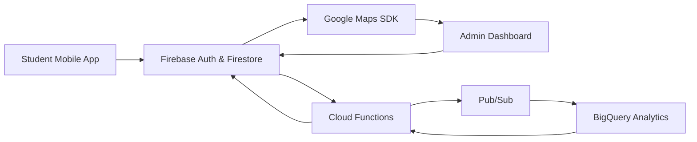

# CampusIQ

**CampusIQ** is a next-generation campus management platform designed to empower administrators, faculty, and students with real-time operational intelligence, exam management, and safety insights.
It combines a **mobile-first interface**, **cloud scalability**, and **secure architecture** to create a smarter, safer, and more efficient campus ecosystem.

---

##  Key Features

### 📌 Academic & Exam Management

* Exam scheduling, conflict detection, and room allocation
* Real-time updates for students and faculty
* Centralized dashboards for academic operations
* AI-assisted scheduling suggestions

### 🏫 Campus Operations

* Task management and workflow tracking
* Campus announcements and notifications
* Role-based permissions for staff hierarchy
* Analytics for overdue tasks and escalations

### 📊 Crowd Intelligence

* Real-time heatmaps showing crowd density
* Hotspot detection for libraries, exam halls, canteen, and events
* Time-based trends for safety and planning
* Privacy-first, anonymized data collection

### 🔐 Enterprise Security

* Zero-trust architecture (frontend untrusted)
* Role-based access control
* Immutable audit trails
* Rate-limiting and abuse detection
* End-to-end encryption

---

## 🏗️ Google Technologies Used & Why

| Technology                  | Purpose                                            | Why Used                                                   |
| --------------------------- | -------------------------------------------------- | ---------------------------------------------------------- |
| **Firebase Authentication** | User login and role-based access                   | Secure, scalable, integrated with Firestore                |
| **Firestore**               | Database for tasks, exams, and crowd data          | Real-time updates, offline support, scalable               |
| **Cloud Functions**         | Server-side business logic and validation          | Zero-trust model; keeps sensitive operations backend-only  |
| **Cloud Pub/Sub**           | Streaming and aggregation of crowd location events | Handles real-time events reliably at scale                 |
| **BigQuery**                | Crowd analytics and historical trends              | Fast, scalable analytics for spatial and temporal queries  |
| **Google Maps SDK**         | Heatmap visualization for admins                   | Industry-standard mapping with rich visualization features |
| **Cloud Scheduler**         | Batch jobs and periodic analytics                  | Automates recurring tasks like data aggregation and alerts |

---

## 🧩 System Architecture



---

## 🛠️ Tech Stack

* **Frontend:** React Native, TypeScript, Redux Toolkit
* **Backend:** Firebase Firestore, Cloud Functions
* **Analytics:** BigQuery, Pub/Sub
* **Mapping & Visualization:** Google Maps SDK
* **Security:** Role-based access, immutable audit logs, rate limiting

---

## 📁 Project Structure

```
campusiq/
├── app/
│   ├── components/
│   │   ├── Task/
│   │   ├── Exam/
│   │   ├── Crowd/
│   │   └── Common/
│   ├── screens/
│   │   ├── Admin/
│   │   ├── User/
│   │   └── Shared/
│   ├── navigation/
│   ├── redux/
│   │   ├── slices/
│   │   └── store.ts
│   ├── services/
│   │   ├── task.service.ts
│   │   ├── exam.service.ts
│   │   ├── crowd.service.ts
│   │   └── firebase.ts
│   ├── utils/
│   └── assets/
├── cloud-functions/
│   ├── secureCreateTask.ts
│   ├── secureCreateExam.ts
│   ├── crowdAggregation.ts
│   └── index.ts
├── docs/
├── package.json
├── tsconfig.json
├── README.md
└── .gitignore
```

---

## 🎯 Philosophy

> **Efficiency without surveillance.
> Intelligence without intrusion.
> Scale without fragility.**

CampusIQ is designed to **deliver real impact while preserving privacy** and ensuring enterprise-grade reliability.

