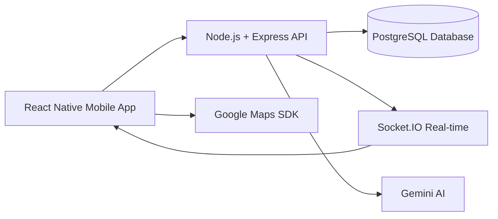

# CampusIQ v1.1

**Admin-Only College Operations Intelligence Platform**

CampusIQ is an enterprise-grade mobile application designed exclusively for college and university administrators. Built for principals, deans, registrars, directors, and executive leadership, it provides a unified platform for managing institutional operations, tracking compliance, and making data-driven decisions.

---

## What's New in v1.1

### Role-Based Permission System
Granular access control for administrative roles:
- **Registrar** — Create and view tasks
- **Dean** — Create, close tasks, export reports
- **Director** — Full operational control (except system config)
- **Executive** — Read-only dashboards, reports, finance, compliance

### Campus Health Score
Real-time institutional health indicator (0–100) computed from:
- Overdue tasks
- Compliance risks
- Pending approvals
- Escalations
- Budget concerns

Color-coded display with AI-generated executive summary powered by Gemini.

### Audit Log System
Enterprise-grade activity tracking:
- Task creation, status changes, priority updates
- Administrative comments
- Compliance-related actions
- Full audit trail per task with role attribution

### Enhanced UX
- Polished empty states across all screens
- Role-aware navigation (actions hidden for read-only roles)
- Consistent administrative terminology
- Executive-first dashboard design

---

## 🚀 Major Update: Backend Migration

**CampusIQ has been migrated from Firebase to a production-ready Node.js + PostgreSQL backend!**

### What Changed

- ✅ **New Backend**: Node.js + Express + PostgreSQL
- ✅ **RESTful API**: Comprehensive REST endpoints for all features
- ✅ **Real-time Updates**: Socket.IO for live notifications and updates
- ✅ **JWT Authentication**: Secure token-based authentication
- ✅ **Docker Support**: Easy deployment with Docker Compose
- ✅ **All Features Preserved**: Attendance, assignments, exams, notifications, AI, maps, and more

### Quick Start

**Backend:**
```bash
cd backend
npm install
cp .env.example .env
# Edit .env with your settings
createdb campusiq
npm run migrate
npm run seed  # Creates test users
npm run dev
```

**Frontend:**
```bash
npm install
# Set API_BASE_URL in .env (default: http://localhost:3000/api)
npm start
npm run android  # or npm run ios
```

**Docker (Alternative):**
```bash
cd backend
docker-compose up -d
```

📚 **For detailed migration guide, see [FIREBASE_TO_POSTGRESQL_MIGRATION.md](./FIREBASE_TO_POSTGRESQL_MIGRATION.md)**  
📚 **For API documentation, see [docs/BACKEND_MIGRATION.md](./docs/BACKEND_MIGRATION.md)**

---

## Overview

CampusIQ transforms how academic institutions manage their administrative workflows. Unlike student-facing applications, CampusIQ is purpose-built for executive leadership and senior staff, offering:

- **Executive Dashboard** — Real-time Campus Health Score and operational metrics
- **AI-Powered Analysis** — Gemini AI integration for intelligent task prioritization
- **Campus Operations Map** — Geographic visualization of facilities and activities
- **Role-Based Access** — Granular permissions per administrative role
- **Audit Trail** — Complete activity logging for compliance and accountability
- **Push Notifications** — Instant alerts for high-priority items
- **Offline Capability** — Continue working without connectivity, auto-sync when online

---

## Core Modules

### 🎓 Academic & Exam Management

* Exam schedules & room allocation
* Conflict detection and load balancing
* Real-time updates for students and faculty
* Centralized exam operations dashboard

### 🏫 Campus Operations

* Announcements & notices
* Department-level coordination
* Infrastructure and resource visibility

### 📊 Crowd Intelligence (Admin Only)

* Anonymous crowd density heatmaps
* Hotspot detection (libraries, exam halls, canteen, events)
* Time-based trends (15 min, 1 hour, daily)
* Designed for **safety, planning, and congestion control**

> ⚠️ No cameras. No personal tracking.
> All data is anonymized, aggregated, and privacy-first.

### 🔐 Security & Trust Layer

* Role-based access control
* JWT-based authentication
* Secure REST APIs and encrypted transport
* Abuse prevention and rate limiting

---

## Key Features

### For Administrators

- **Operations Management** — Create, track, and resolve institutional tasks
- **Priority Classification** — AI-assisted categorization (Admissions, Academics, Compliance, Finance, HR, IT, Facilities)
- **Status Workflows** — New → In Progress → Completed / Escalated
- **Performance Metrics** — Average resolution time and workload distribution
- **Audit Compliance** — Full activity trail for regulatory requirements

### Enterprise Architecture

- **Node.js + PostgreSQL Backend** — Production-ready REST API with real-time Socket.IO updates
- **Redux State Management** — Predictable application state with audit integration
- **TypeScript** — Type-safe development
- **React Native** — Cross-platform (Android primary, iOS ready)

---

## Target Users

CampusIQ is designed for authorized institutional personnel only:

| Role | Access Level | Permissions |
|------|--------------|-------------|
| Executive | Strategic oversight | View-only dashboards, reports, compliance |
| Director | Full operations | Create, close, assign, delete tasks; manage compliance/finance |
| Dean | Academic leadership | Create, close tasks; export reports; view compliance |
| Registrar | Records management | Create and view tasks |

---

## 🏗️ System Architecture



---

## Project Structure

```
src/
├── components/
│   ├── AuditTrail.tsx      # Audit log display component
│   ├── EmptyState.tsx      # Polished empty state variants
│   ├── HealthScoreCard.tsx # Campus health score display
│   ├── PermissionGate.tsx  # Role-based UI guard
│   ├── ReportForm.tsx      # Task creation form
│   ├── StatusBadge.tsx     # Status/priority badges
│   └── TaskCard.tsx        # Task card component
├── config/
│   └── permissions.ts      # Centralized role permissions
├── navigation/
│   └── RootNavigator.tsx   # Role-aware navigation
├── redux/
│   ├── auditSlice.ts       # Audit log state
│   ├── authSlice.ts        # Authentication with admin roles
│   ├── store.ts            # Redux store configuration
│   └── taskSlice.ts        # Operations/tasks state
├── screens/
│   ├── Admin/
│   │   ├── CampusMapScreen.tsx
│   │   ├── CreateTaskScreen.tsx
│   │   ├── ExecutiveDashboard.tsx
│   │   └── TaskDetailScreen.tsx
│   └── Auth/
│       ├── LoginScreen.tsx
│       └── RegisterScreen.tsx
├── services/
│   ├── demoSeed.service.ts
│   ├── firebase.ts
│   ├── gemini.service.ts
│   ├── healthScore.service.ts
│   ├── maps.service.ts
│   └── notification.service.ts
└── App.tsx
```

---

## Technical Requirements

### Development Environment

- Node.js 18+
- React Native CLI
- Android Studio (Android development)
- Xcode (iOS development)

### Dependencies

```bash
# Install packages
npm install

# Start Metro bundler
npm start

# Run on Android
npm run android

# Run on iOS
npm run ios
```

### Backend Configuration

1. **Set up PostgreSQL database:**
   ```bash
   createdb campusiq
   ```

2. **Configure backend environment:**
   ```bash
   cd backend
   cp .env.example .env
   # Edit .env with your database credentials and API keys
   ```

3. **Run database migrations:**
   ```bash
   npm run migrate
   ```

4. **Seed test data (optional):**
   ```bash
   npm run seed
   ```

### Frontend Configuration

Create a `.env` file in the project root:

```env
API_BASE_URL=http://localhost:3000/api
# For Android emulator: http://10.0.2.2:3000/api
# For iOS simulator: http://localhost:3000/api
# For production: https://your-api-domain.com/api
```

### Database Schema

The PostgreSQL database includes tables for:
- Users, Courses, Enrollments
- Attendance, Assignments, Exams
- Notifications, Announcements, Events
- Security (SOS alerts, incidents)
- AI chat logs, Audit logs
- Maps, Geofence zones
- And more...

See `backend/src/database/schema.sql` for complete schema.

---

## 🧠 Crowd Intelligence – Design Principles

* **Anonymized location pings**
* **Spatial aggregation using geohash / S2 cells**
* **Minimum threshold enforcement** (no small group visibility)
* **Admin-only access**
* **Read-only insights, no individual tracking**

This ensures the feature is useful for:

* Exam-day crowd control
* Emergency preparedness
* Infrastructure planning

Without introducing surveillance risk.

---

## 🛠️ Tech Stack

### Frontend

* React Native
* Google Maps SDK

### Backend & Database

* Node.js + Express
* PostgreSQL
* Socket.IO (Real-time)
* JWT Authentication
* Gemini AI Integration

### Security

* HTTPS everywhere
* Role-based permissions
* Aggregation-only analytics
* Zero raw user exposure

---

## Security

CampusIQ implements **enterprise-grade security** with multiple layers of protection:

- **JWT Authentication** — Secure token-based authentication with expiration
- **Server-Side Authorization** — API endpoints validate permissions and roles on every request
- **Role-Based Access Control** — Granular permissions enforced at the API level
- **Rate Limiting** — Protection against abuse and excessive requests
- **Immutable Audit Trail** — Complete activity logging in PostgreSQL
- **Transport Security** — HTTPS/TLS for all network communications
- **SQL Injection Protection** — Parameterized queries prevent SQL injection
- **Input Validation** — All inputs validated and sanitized

**📚 For detailed security documentation, see [SECURITY.md](./SECURITY.md)**

---

## Package Identifiers

| Platform | Identifier |
|----------|------------|
| Android | `com.campusiq` |
| iOS | `com.campusiq` |

---

## Building for Production

### Android

```bash
cd android
./gradlew assembleRelease
```

APK location: `android/app/build/outputs/apk/release/app-release.apk`

### iOS

Build using Xcode Archive workflow.

---

## 🚀 Vision

CampusIQ is built to evolve into a **decision intelligence platform for campuses**, not just a management app.

Future directions include:

* Predictive crowd analytics
* Smart exam logistics
* AI-assisted academic planning
* Campus-wide operational intelligence

---

## 📜 Philosophy

> **Efficiency without surveillance.
> Intelligence without intrusion.
> Scale without fragility.**

CampusIQ is designed to earn trust while delivering impact.

---

## Support

CampusIQ is designed for institutional deployment. For implementation support, customization, or enterprise licensing inquiries, contact your system administrator.

---

## License

Proprietary. For authorized institutional use only.

---

*CampusIQ v1.1 — Intelligent Operations for Academic Excellence*
